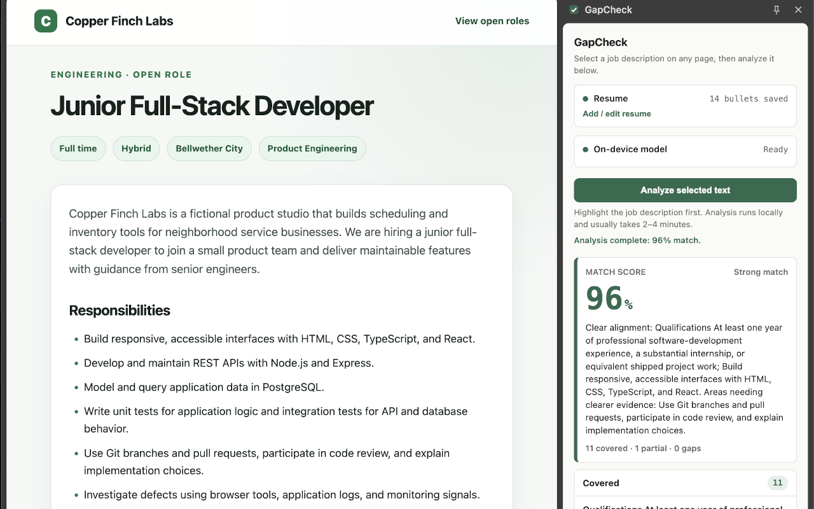

# GapCheck

GapCheck is a Manifest V3 Chrome extension that compares a selected job posting against a saved resume using Chrome's built-in Prompt API, powered by Gemini Nano. It produces an on-device match score and organizes the posting's requirements into Covered, Partial, and Gaps sections with supporting resume evidence.



## Features

- Save a pasted resume or import a text-based PDF from the extension's options page.
- Select job-posting text on a webpage and analyze it from the side panel.
- Review a match score, concise summary, and requirement-by-requirement results.
- Keep the resume and analysis on the device with no API keys or server calls.

## Load in Chrome

1. Open `chrome://extensions`.
2. Turn on Developer mode.
3. Click Load unpacked.
4. Select this repo's project folder.
5. Pin GapCheck from the toolbar menu if you want quick access.

## Use GapCheck

1. Open GapCheck's options page and either paste your resume or choose a PDF.
2. For a PDF, review the locally extracted text and click Use and save this resume. For pasted text, click Save resume.
3. Open a job posting and select the text you want to analyze.
4. Open the GapCheck side panel and click Analyze selected text.
5. Review the score, summary, covered requirements, partial matches, and gaps.

## Reload After Changes

Chrome does not automatically reload unpacked extensions after file changes.

After editing extension files, open `chrome://extensions` and click the reload icon on the GapCheck extension card. If the side panel or options page is already open, close and reopen it after reloading.

## Production Package

Run `npm run package:extension` to create a production-only Chrome Web Store
ZIP and SHA-256 checksum under `dist/`. The package uses an explicit runtime
file allowlist and excludes tests, documentation, screenshots, dependency
metadata, and other development-only files.

The **Package Chrome extension** GitHub Actions workflow runs the test and
type-check suites before producing the same artifacts. It can be started
manually or by pushing a version tag matching the manifest version, such as
`v1.0.0`.

## Development Benchmark Runner

GapCheck includes a browser-based runner for the packaged Product Operations,
Web Developer, Junior Full-Stack, and Software Consultancy benchmarks. After
loading or reloading the unpacked extension:

1. Open `chrome://extensions` and copy the ID shown on the GapCheck extension card.
2. Replace `<extension-id>` in the URL below with that ID:

   ```text
   chrome-extension://<extension-id>/tests/benchmark-runner.html
   ```

3. Open the resulting URL in Chrome, select the benchmark families, resume
   cases, test mode, and repetition count, and click Run benchmarks.

Each model pass can take one to two minutes, so a full two-pass analysis can
take two to four minutes. Keep the runner page open and the computer awake
until the queue finishes. See the
[benchmark fixture guide](tests/fixtures/README.md) for the fixture structure,
expected behavior, cancellation behavior, and report details.

## Built-In AI Requirement

GapCheck uses Chrome's built-in Prompt API with Gemini Nano for local analysis. Chrome extensions can use the API in Chrome 138 or later on a [supported device](https://developer.chrome.com/docs/ai/prompt-api#hardware). The side panel checks model readiness, starts the model download from the Analyze action when needed, shows download and finalization progress, automatically rechecks temporary unavailability or active downloads, and provides an in-panel session retry.

The initial model download can take time. If Chrome reports that the model is unavailable, follow the status shown in the side panel and confirm that the device and Chrome installation support the built-in Prompt API.

## Privacy

Neither your resume, imported PDF text, nor your analysis leaves your device. PDF extraction and AI analysis both run locally. GapCheck stores the saved resume in Chrome's local extension storage and does not require an API key or make server calls for analysis.

See the [GapCheck Privacy Policy](PRIVACY.md) for details about handled data,
local retention, permissions, deletion controls, and diagnostic logging.

## Current Limitations

- Match results are AI-generated and can vary between runs.
- The score is a directional comparison, not a hiring recommendation or guarantee.
- Company descriptions, equal opportunity and E-Verify statements, and other non-requirement boilerplate are automatically excluded from analysis and do not appear in results.
- Selected text is processed in bounded sections; text beyond 18,000 characters is excluded with a visible warning.
- Job text must be selected manually; GapCheck does not automatically scrape the page.
- PDF import supports text-based files up to 15 MB and 50 pages. Scanned or image-only PDFs require OCR and are not supported; complex layouts should be reviewed in the extraction preview before saving.

See [Scoring Behavior and Known Limitations](docs/scoring-behavior.md) for the
production formula, calibration decision, long-input behavior, and detailed
limitations established during Phase 6.

## Version

Current package version: **1.0.0**

## Third-Party Software

Local PDF extraction uses Mozilla PDF.js 6.1.200, bundled with the extension under the Apache License 2.0. The bundled license is available at `vendor/pdfjs/LICENSE`.
